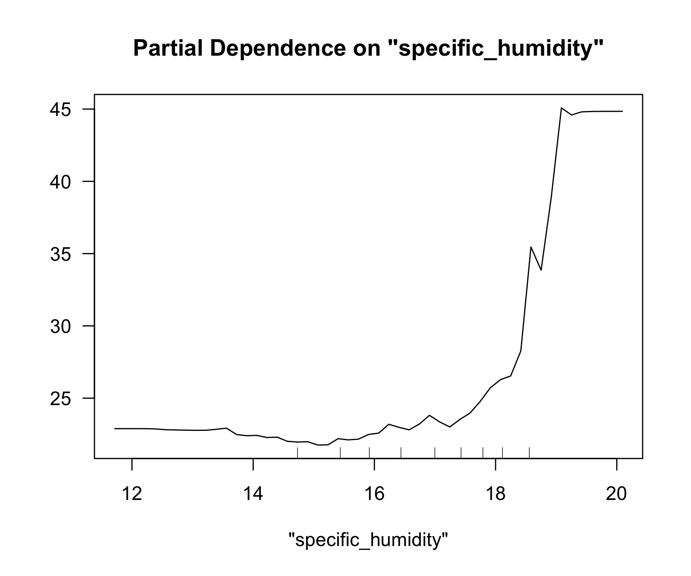
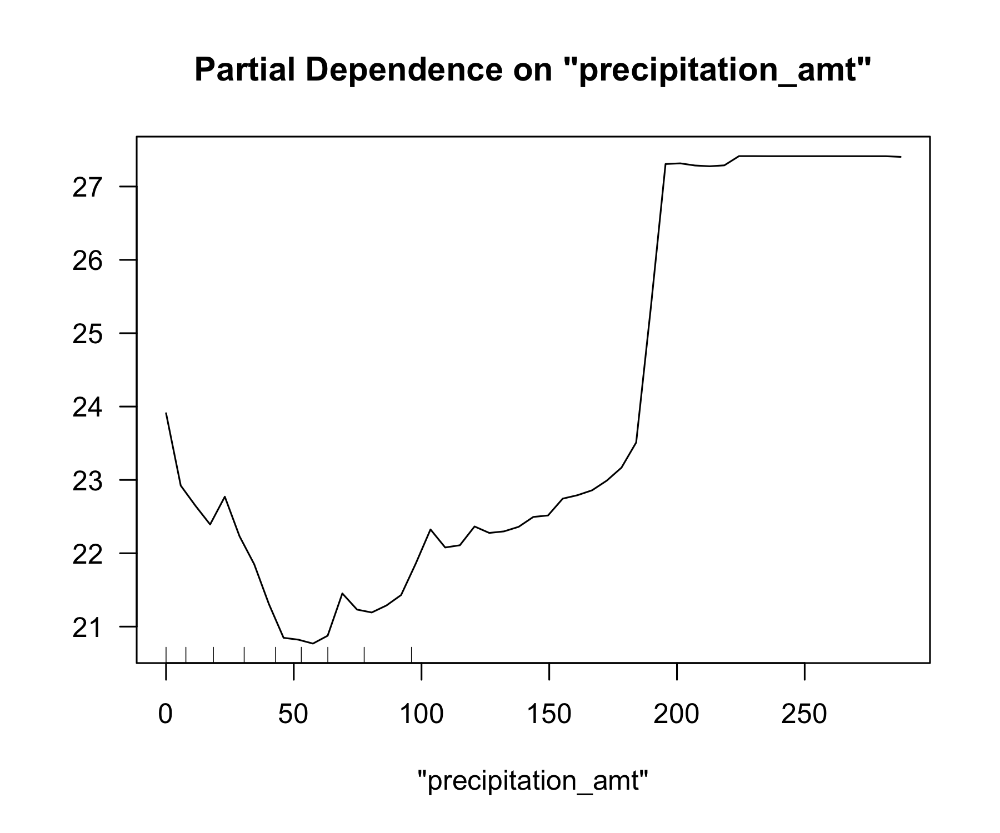

# ECO 395M: Exercises 3

## What causes what?

**1. Why can’t I just get data from a few different cities and run the
regression of “Crime” on “Police” to understand how more cops in the
streets affect crime? (“Crime” refers to some measure of crime rate and
“Police” measures the number of cops in a city.)**

Higher crime cities are already incentivized to hire more police. And
when crime is increased, the response is to hire more police. To
actually find causality of extra police on crime rate, you need to find
examples of where extra police get hired for reasons uncorrelated with
crime. Examples of this include using the terrorism alert system as
mentioned in the podcast.

**2. How were the researchers from UPenn able to isolate this effect?
Briefly describe their approach and discuss their result in the “Table
2” below, from the researchers’ paper.**

The researchers were able to isolate this effect by implementing a dummy
variable for ‘high alert’ that signifies the terror alert in Washington
D.C. is turned to orange. When that happens, extra police is put on the
street for terrorism related reasons. This is important because in this
case, the extra level of police is uncorrelated with crime, so you can
make a better test of the causal effect of police on crime.

**3. Why did they have to control for Metro ridership? What was that
trying to capture?**

They controlled for Metro ridership because an orange terror alert level
might actually reduce the amount of potential crime victims in
Washington D.C. during high alert times. So they accounted for that in
the second model to see if would change their results.

**4. Below I am showing you “Table 4” from the researchers’ paper. Just
focus on the first column of the table. Can you describe the model being
estimated here? What is the conclusion?**

The model measures the reduction in crime in Washington D.C. during high
alert days. The model also uses a dummy for crime incidents in District
1 where there are a lot of important political and historic buildings,
as well as a dummy for the rest of the city. It also controls for Metro
ridership. The model concludes that on high alert days, the reduction in
crime in the first district of Washington D.C. is much higher than it is
for the rest of the districts.

## Tree modeling: dengue cases

``` r
dengue = read.csv("dengue.csv")

dengue = drop_na(dengue)
dengue$city = factor(dengue$city)
dengue$season = factor(dengue$season)

dengue_split = initial_split(dengue, prop = 0.8)
dengue_train = training(dengue_split)
dengue_test = testing(dengue_split)
```

### CART

``` r
dengue.tree = rpart(total_cases ~ season + city + specific_humidity + precipitation_amt + tdtr_k + precip_amt_kg_per_m2  + dew_point_temp_k + relative_humidity_percent, data=dengue_train, control = rpart.control(cp = 0.002, minsplit=30))

prune_1se = function(my_tree) {
  out = as.data.frame(my_tree$cptable)
  thresh = min(out$xerror + out$xstd)
  cp_opt = max(out$CP[out$xerror <= thresh])
  prune(my_tree, cp=cp_opt)
}

dengue.tree_prune = prune_1se(dengue.tree)
rpart.plot(dengue.tree, digits=-5, type=4, extra=1)
```


### Random forest

``` r
dengue.forest = randomForest(total_cases ~ season + city + specific_humidity + precipitation_amt + tdtr_k + precip_amt_kg_per_m2  + dew_point_temp_k + relative_humidity_percent, data=dengue_train, importance = TRUE)
```

### Gradient boost

``` r
dengue_boost = gbm(total_cases ~ season + city + specific_humidity + precipitation_amt + tdtr_k + precip_amt_kg_per_m2  + dew_point_temp_k + relative_humidity_percent, distribution="gaussian", data=dengue_train, interaction.depth=4, n.trees=500, shrinkage=.05)
```

### Results

| Model            |     RMSE |
|:-----------------|---------:|
| Tree             | 26.20831 |
| Pruned Tree      | 27.60546 |
| Random Forest    | 24.60582 |
| Gradient Boosted | 24.42566 |

The best performing model was the random forest model. Below are partial
dependence plots for `specific_humidity`,
`precipitation_amt`,`dew_point_temp_k`.



## Predictive model building: green certification

    ## Distribution not specified, assuming gaussian ...

    ## [1] 1161.282

    ## [1] 1144.251

    ## [1] 1060.626

    ## [1] 1116.244

    ## [1] 815.2901

    ## [1] 997.5279

## Predictive model building: California housing

    ## Distribution not specified, assuming gaussian ...

    ## [1] 77000.8

    ## [1] 77188.81

    ## [1] 78609.87

    ## [1] 79393.94

    ## [1] 65710.6

    ## [1] 66744.92


