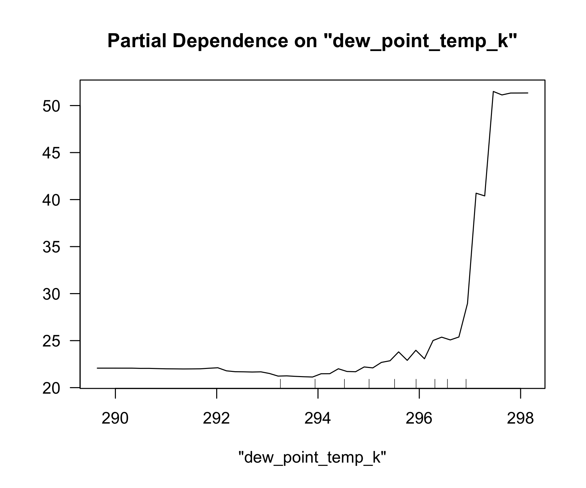
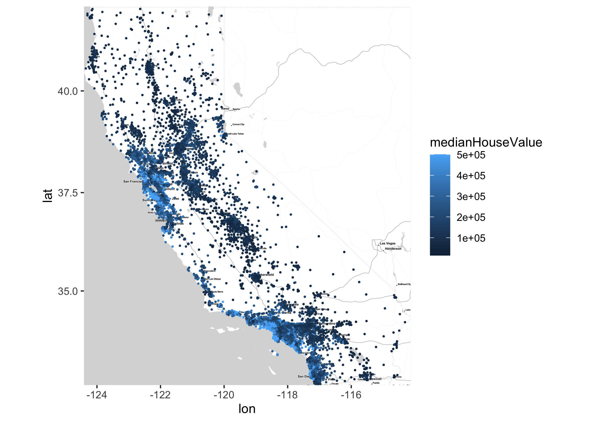
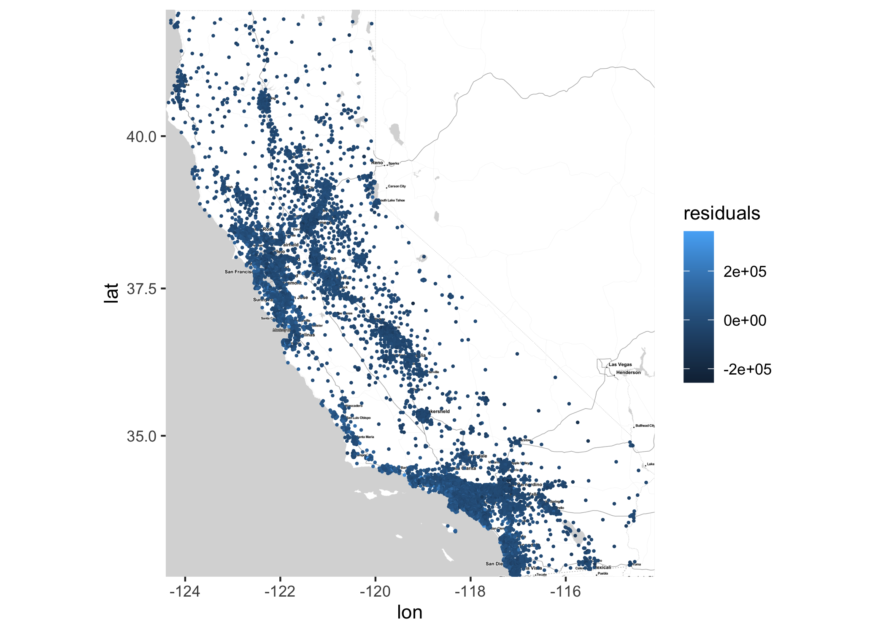

## What causes what?

## Tree modeling: dengue cases

### CART

### Random forest

    ## Distribution not specified, assuming gaussian ...

    ## [1] 24.60072

    ## [1] 25.42507

    ## [1] 23.00512

    ## [1] 25.00457

## Predictive model building: green certification

    ## Distribution not specified, assuming gaussian ...

    ## [1] 1072.544

    ## [1] 1076.944

    ## [1] 1115.806

    ## [1] 1166.302

    ## [1] 852.8638

    ## [1] 1042.664

## Predictive model building: California housing

    ## Distribution not specified, assuming gaussian ...

    ## [1] 77459

    ## [1] 76212.91

    ## [1] 80425.21

    ## [1] 81006.67

    ## [1] 67060.25

    ## [1] 68029.17

